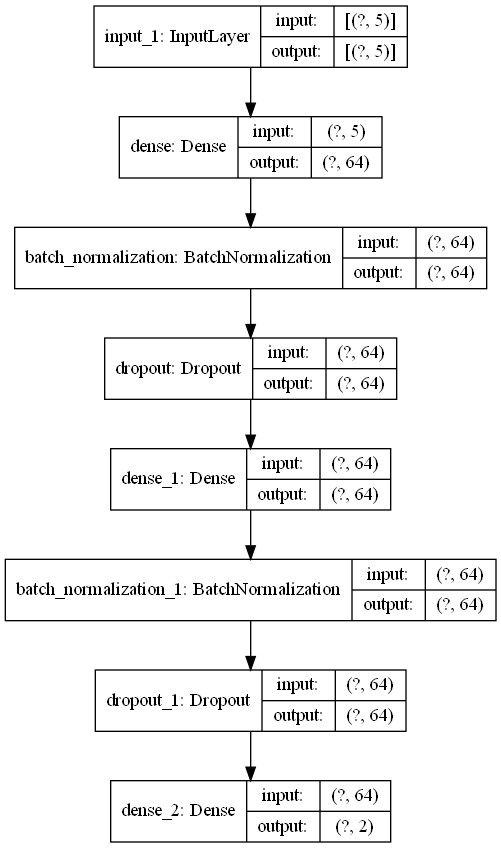
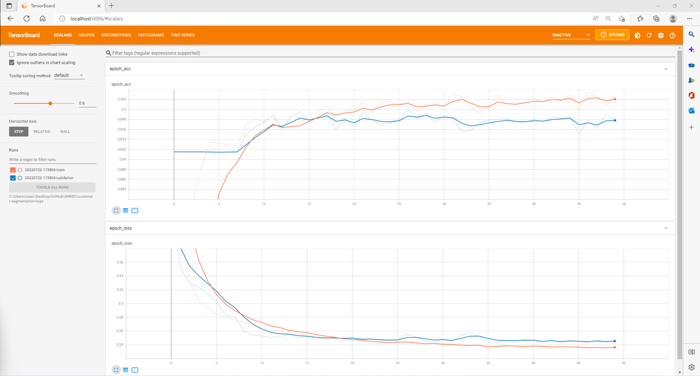
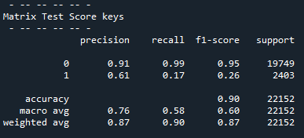

# :bank: Customer Segmentation

To predict accurately whether the customer will subscribe to the focus product for the campaign by using Deep Learning approach.

## Description

A Data Science project using Deep Learning via TensorFlow library for classification problem.

## Getting Started

### Dependencies

* Matplotlib version 3.5*
* Numpy version 1.22*
* Pandas version 1.4*
* Python version 3.8*
* Scikit-learn version 1.0*
* Scipy version 1.7*
* Seaborn 0.11*
* TensorBoard 2.9*

### Datasets

* Datasets : [Customer Segmentation](https://www.kaggle.com/datasets/kunalgupta2616/hackerearth-customer-segmentation-hackathon)

### Executing program

* Code can be clone and run directly using any IDE with the environment listed
* The script was divided into several categories such as:
1. Data Loading
2. Data Inspection & Visualization
3. Data Cleaning
4. Feature Selection
5. Data Preprocessing
6. Model Development
7. Model Analysis

### Results

* Model Architecture 

* TensorBoard

Model seems to start overfit around 30th epoch

* The classification results are as follows:

### Future Works

* Although the accuracy score is high, more improvement can be implemented such as balanced the imbalanced data using [SMOTE](https://machinelearningmastery.com/smote-oversampling-for-imbalanced-classification/) approach
* Furthermore, more architecture of models may be tested to optimize or improve the performances

## Acknowledgments

I would like to express my gratitude to Mr. Alex and Dr. Loo for the guidance throughout the training session and finally to SHRDC and the supporting staff for making this possible.
* [Selangor Human Resource Development Centre](https://www.shrdc.org.my/)
* [KUNAL GUPTA](https://www.kaggle.com/kunalgupta2616) for datasets

PEACE OUT :love_you_gesture:
